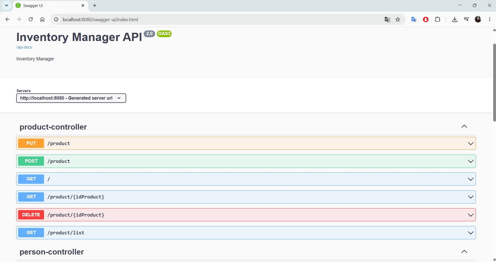
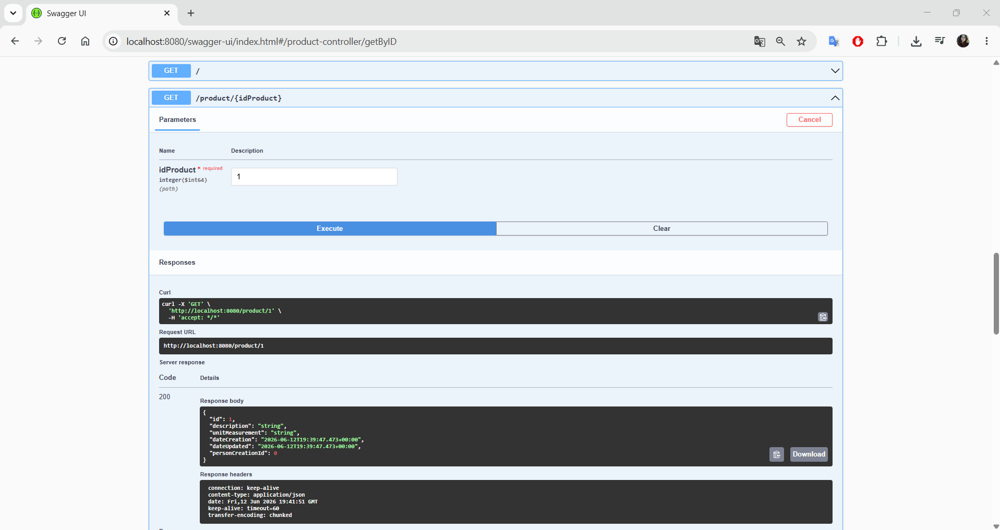
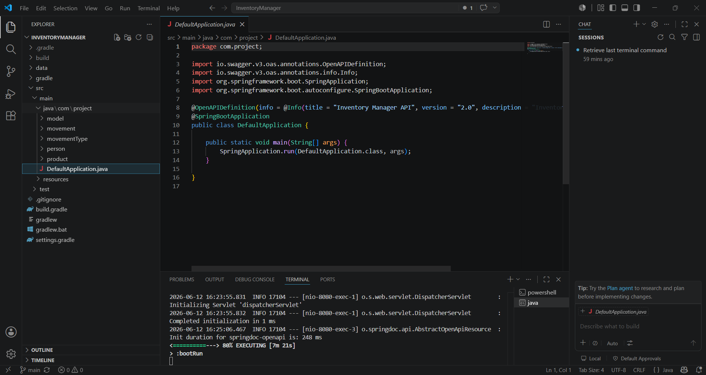
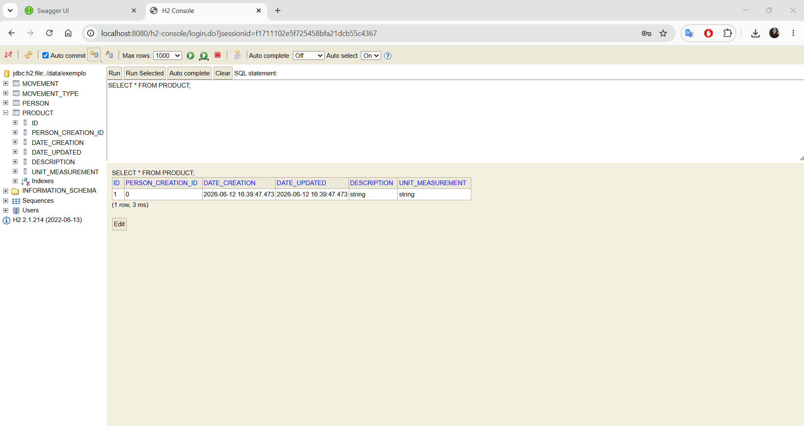

# Inventory Manager

Sistema de gerenciamento de estoque desenvolvido com Java e Spring Boot para controle de produtos, movimentações de entrada e saída, usuários responsáveis pelas operações e tipos de movimentação.

## Objetivo

O projeto foi criado para praticar conceitos fundamentais de desenvolvimento backend, aplicando arquitetura em camadas, persistência de dados, APIs REST e testes automatizados.

## Funcionalidades

* Cadastro de produtos
* Consulta de produtos
* Atualização de informações de produtos
* Exclusão de produtos
* Controle de movimentações de estoque
* Registro de entradas e saídas
* Cadastro de pessoas responsáveis pelas movimentações
* Cadastro de tipos de movimentação
* Documentação da API com Swagger/OpenAPI
* Testes automatizados

## Tecnologias Utilizadas

* Java 17
* Spring Boot
* Spring Data JPA
* H2 Database
* Maven
* Lombok
* Swagger/OpenAPI
* JUnit 5
* Git
* GitHub

## Arquitetura

O projeto segue uma arquitetura em camadas:

```text
Controller
   ↓
Service
   ↓
Repository
   ↓
Database
```

### Responsabilidades

* Controller: exposição dos endpoints REST.
* Service: regras de negócio.
* Repository: acesso aos dados.
* Entity: modelagem das entidades do sistema.

## Estrutura do Projeto

```text
src
├── controller
├── service
├── repository
├── entity
├── dto
├── config
└── tests
```

## Principais Entidades

### Produto

Responsável pelo cadastro e gerenciamento dos itens do estoque.

### Pessoa

Representa os usuários responsáveis pelas movimentações.

### Movimentação

Registra operações de entrada e saída de produtos.

### Tipo de Movimentação

Define a natureza da movimentação realizada.

## Como Executar

### Pré-requisitos

* Java 17
* Spring Boot 2.5.7
* Gradle 7.5

### Clonar o projeto

### Executar
### Verificar versoes java e gradle
```bash
gradlew.bat --version
```

### Compilar o projeto
* Se o passo executar mostrar Java 17, execute:
```bash
gradlew.bat clean build
```
* Esse comando vai: baixar dependências; compilar; executar os testes
  
### Subir a aplicação
```bash
gradlew.bat bootRun
```

### Documentação da API
* Validar que a API subiu
** Quando a aplicação iniciar corretamente, procure no terminal algo parecido com:
```bash
Tomcat started on port(s): 8080
Started InventoryManagerApplication
```
* No navegador:
```
http://localhost:8080/swagger-ui/index.html
```
## Aprendizados

Durante o desenvolvimento deste projeto foram aplicados conceitos de:

* Programação Orientada a Objetos (POO)
* APIs REST
* Spring Boot
* Persistência de dados com JPA
* Arquitetura em camadas
* Tratamento de exceções
* Testes automatizados
* Versionamento com Git

## API Documentation



## Example Request



## Project Structure



## Data Base



## Desenvolvido por

Projeto desenvolvido de forma colaborativa como prática de desenvolvimento backend utilizando o ecossistema Spring.


